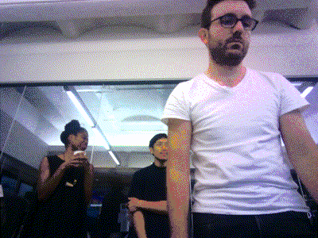

# Coral PoseNet

Pose estimation refers to computer vision techniques that detect human figures
in images and video, so that one could determine, for example, where someone’s
elbow, shoulder or foot show up in an image. PoseNet does not recognize
who is in an image, it is simply estimating where key body joints are.

This repo contains a set of PoseNet models that are quantized and optimized for
use on Coral's Edge TPU, together with some example code to shows how to run it
on a camera stream.

## Why PoseNet ?

Pose estimation has many uses, from [interactive](https://vimeo.com/128375543)
[installations](https://www.youtube.com/watch?v=I5__9hq-yas)
that [react](https://vimeo.com/34824490) to the
[body](https://vimeo.com/2892576)
to [augmented reality](https://www.instagram.com/p/BbkKLiegrTR/),
[animation](https://www.instagram.com/p/Bg1EgOihgyh/?taken-by=millchannel),
[fitness uses](https://www.runnersneed.com/expert-advice/gear-guides/gait-analysis.html),
and more. We hope the accessibility of this model inspires more developers and 
makers to experiment and apply pose detection to their own unique projects, to 
demonstrate how machine learning can be deployed in ways that are anonymous 
and private. 

## How does it work ?

At a high level pose estimation happens in two phases:
1) An input RGB image is fed through a convolutional neural network. In our case
this is a MobileNet V1 architecture. Instead of a classification head however,
there is a specialized head which produces a set of heatmaps (one for each kind
of key point) and some offset maps. This step runs on the EdgeTPU. The results
are then fed into step 2)

2) A special multi-pose decoding algorithm is used to decode poses, pose
confidence scores, keypoint positions, and keypoint confidence scores. Note that
unlike in the [TensorflowJS
version](https://medium.com/tensorflow/real-time-human-pose-estimation-in-the-browser-with-tensorflow-js-7dd0bc881cd5)
we have created a custom OP in Tensorflow Lite and appended it to the network
graph itself. This CustomOP does the decoding (on the CPU) as a post processing
step. The advantage is that we don't have to deal with the heatmaps directly and
when we then call this network through the Coral Python API we
simply get a series of keypoints from the network.

If you're interested in the gory details of the decoding algorithm and how
PoseNet works under the hood, I recommend you take a look at the original
[research paper](https://arxiv.org/abs/1803.08225) or this [medium
post](https://medium.com/tensorflow/real-time-human-pose-estimation-in-the-browser-with-tensorflow-js-7dd0bc881cd5)
whihch describes the raw heatmaps produced by the convolutional model.


### Important concepts


__Pose__: at the highest level, PoseNet will return a pose object that contains a
list of keypoints and an instance-level confidence score for each detected person.


__Keypoint__: a part of a person’s pose that is estimated, such as the nose,
right ear, left knee, right foot, etc. It contains both a position and a
keypoint confidence score. PoseNet currently detects 17 keypoints illustrated
in the following diagram:


__Keypoint Confidence Score__: this determines the confidence that an estimated
keypoint position is accurate. It ranges between 0.0 and 1.0. It can be used to
hide keypoints that are not deemed strong enough.


__Keypoint Position__: 2D x and y coordinates in the original input image where
a keypoint has been detected.


## Examples in this repo

NOTE: PoseNet relies on the latest Pycoral API, tflite_runtime API, and libedgetpu1-std or libedgetpu1-max:
  * For [pycoral](https://coral.ai/software#pycoral-api)
  * For [tflite_runtime](https://www.tensorflow.org/lite/guide/python#install_just_the_tensorflow_lite_interpreter)
  * For [libedgetpu](https://coral.ai/software#debian-packages), please install the [debian package](https://coral.ai/software#debian-packages) or [shared libraries](https://coral.ai/software#edgetpu-runtime). You can use either Max or Standard clock speed (these only apply for USB devices).

Please also update your system before running these examples. For more information on updating see:
  * For [Coral DevBoard](https://coral.withgoogle.com/docs/dev-board/get-started/#update-the-mendel-software)
  * For [USB Accelerator](https://coral.withgoogle.com/docs/accelerator/get-started/#set-up-on-linux-or-raspberry-pi)

To install all other requirements for third party libraries, simply run 

```
sh install_requirements.sh
```

### simple_pose.py


A minimal example that simply downloads an image, and prints the pose
keypoints.

```bash
python3 simple_pose.py
```

### pose_camera.py

A camera example that streams the camera image through posenet and
draws the pose on top as an overlay. This is a great first example to run to
familiarize yourself with the network and its outputs.

Run a simple demo like this:

```bash
python3 pose_camera.py
```

If the camera and monitor are both facing you, consider adding the `--mirror` flag:

```bash
python3 pose_camera.py --mirror
```

In this repo we have included 3 posenet model files for differnet input
resolutions. The larger resolutions are slower of course, but allow a wider
field of view, or further-away poses to be processed correctly.

```bash
posenet_mobilenet_v1_075_721_1281_quant_decoder_edgetpu.tflite
posenet_mobilenet_v1_075_481_641_quant_decoder_edgetpu.tflite
posenet_mobilenet_v1_075_353_481_quant_decoder_edgetpu.tflite
```

You can change the camera resolution by using the --res parameter:

```bash
python3 pose_camera.py --res 480x360  # fast but low res
python3 pose_camera.py --res 640x480  # default
python3 pose_camera.py --res 1280x720 # slower but high res
```

### anonymizer.py

A fun little app that demonstrates how Coral and PoseNet can be used to analyze
human behavior in an anonymous and privacy-preserving way.

Posenet converts an image of a human into a mere skeleton which captures its
position and movement over time, but discards any precisely identifying features
and the original camera image.
Because Coral devices run all the image analysis 
locally, the actual image is never streamed anywhere and is immediately
discarded. The poses can be safely stored or analysed.

For example a store owner
may want to study the bahavior of customers as they move through the store, in
order to optimize flow and improve product placement.
A museum may want to track which areas are most busy, at which times such as to
give guidance which exhibits may currently have the shortest waiting times.

With Coral this is possible without recording anybody's image directly or
streaming data to a cloud service - instead the images are immediately
discarded.

The anaonymizer is a small app that demonstrates this is a fun way.
To use the anonymizer set up your camera in a sturdy position. Lauch the app
and walk out of the image. This demo waits until no one is in the frame, then
stores the 'background' image. Now, step back in. You'll see your
current pose overlayed over a static image of the background.

```bash
python3 anonymizer.py
```

(If the camera and monitor are both facing you, consider adding the `--mirror` flag.)



### synthesizer.py

This demo allows people to control musical synthesizers with their arms. Up to
3 people are each assigned a different instrument and octave, and control the
pitch with their right wrists and the volume with their left wrists.

You'll need to install FluidSynth and a General Midi SoundFont:
```bash
apt install fluidsynth fluid-soundfont-gm
pip3 install pyfluidsynth
```

Now you can run the demo like this:

```bash
python3 synthesizer.py
```

## The PoseEngine class

The PoseEngine class (defined in ```pose_engine.py```) allows easy access
to the PoseNet network from Python, using the EdgeTPU API.

You simply initialize the class with the location of the model ```.tflite```
file and then call DetectPosesInImage, passing a numpy object that contains the
image. The numpy object should be in int8, [Y,X,RGB] format.

A minimal example might be:

```
from tflite_runtime.interpreter import Interpreter
import os
import numpy as np
from PIL import Image
from PIL import ImageDraw
from pose_engine import PoseEngine


os.system('wget https://upload.wikimedia.org/wikipedia/commons/thumb/3/38/'
          'Hindu_marriage_ceremony_offering.jpg/'
          '640px-Hindu_marriage_ceremony_offering.jpg -O /tmp/couple.jpg')
pil_image = Image.open('/tmp/couple.jpg').convert('RGB')
engine = PoseEngine(
    'models/mobilenet/posenet_mobilenet_v1_075_481_641_quant_decoder_edgetpu.tflite')
poses, _ = engine.DetectPosesInImage(pil_image)

for pose in poses:
    if pose.score < 0.4: continue
    print('\nPose Score: ', pose.score)
    for label, keypoint in pose.keypoints.items():
        print('  %-20s x=%-4d y=%-4d score=%.1f' %
              (label, keypoint.point[0], keypoint.point[1], keypoint.score))
```

To try this, run
```bash
python3 simple_pose.py
```

And you should see an output like this:


```
Inference time: 14 ms

Pose Score:  0.60698134
  NOSE                 x=211  y=152  score=1.0
  LEFT_EYE             x=224  y=138  score=1.0
  RIGHT_EYE            x=199  y=136  score=1.0
  LEFT_EAR             x=245  y=135  score=1.0
  RIGHT_EAR            x=183  y=129  score=0.8
  LEFT_SHOULDER        x=269  y=169  score=0.7
  RIGHT_SHOULDER       x=160  y=173  score=1.0
  LEFT_ELBOW           x=281  y=255  score=0.6
  RIGHT_ELBOW          x=153  y=253  score=1.0
  LEFT_WRIST           x=237  y=333  score=0.6
  RIGHT_WRIST          x=163  y=305  score=0.5
  LEFT_HIP             x=256  y=318  score=0.2
  RIGHT_HIP            x=171  y=311  score=0.2
  LEFT_KNEE            x=221  y=342  score=0.3
  RIGHT_KNEE           x=209  y=340  score=0.3
  LEFT_ANKLE           x=188  y=408  score=0.2
  RIGHT_ANKLE          x=189  y=410  score=0.2

```
